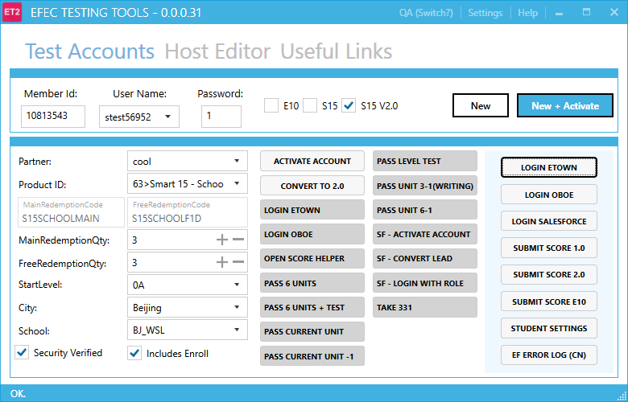

A Guide to ET2
=============================

Thanks for choosing ET2. This is a guide to help you configure this tool. ET2 stands for EFEC Testing Tools.

### 1. Installation

Open `\\cns-qaauto5\Shared\ET2` then run `ET2.application`. You will get automatically update when feature added.

### 2. Features

- Create EFEC test accounts by simple clicks.
- Provide test links according to current test environment and test account.
- Perform quick actions to boost your manual testing.
- Multiple host profiles provied, switch to any one you like in a second.
- Remember useful links hits and sort by frequency.

### 3. Configuration

To start configure this tool, you should only have to focus on `public` or `private` settings folder.

#### 3.1 Public Settings Folder

Default value: `\\cns-qaauto5\Shared\ET2\Settings`

You can find environments, products, userful links and hosts data over here, they are all in csv format, just open with any text editor you preferred to update them. 

> WARNING: **Changes in public settings** will impact all ET2 users.
>
> TIPS: Copy public setting file to your private settings folder can overrite it without impact others.

#### 3.2 Private Settings Folder

Default value: `%UserProfile%\ET2`

You can see application saved state and private hosts at here, also there are a `QuickActions` folder which contains actions people defined.

> TIPS: You can read the saved states in your quick action, that may help you create magic actions.

#### 3.3 Public Configurations

- ET2_DB.txt (Almost all settings are now saved in DB)
- Hosts(Folder to place public host settings)
- QuickActions (Remote quick actions, will be updated via Jenkins job)

#### 3.4 Private Configurations

- Save.XXXX (State file for a saved entity, e.g. Save.CurrentTestAccount)
- Hosts (Folder to place private host settings)
- QuickActions (Local quick actions, do not change)

#### 3.5 Token Replacement

Token replacement is wildly used in ET2, you can set token in useful links or quick actions. Current we supported bellow tokens:

- $id (=> member id)
- $name (=> student name)
- $env (=> current test environment name, e.g. UAT/QA)
- $envStr (=> current test environment string, e.g. smartuat2/qa)
- $partner (=> current selected partner)
- $school (=> current selected school)
- $level (=> current selected start level)
- $productId (=> current selected product id)
- $accountType (=> current selected accountType)
- $etownUrl (=> etown URL according to env)
- $token (=> current secret token)
- $mark (=> another identity for current environment, e.g. livecn/liveus)

#### 3.6 Quick Actions

To add new quick actions, you have to publish to '[**PublicSettings**]/QuickActions' folder. 

Please follow steps:

1. Ensure you have access the quick action repository, if not ping Toby to get it.
2. Clone quick action repo: https://bitbucket.englishtown.cn/users/toby.qin/repos/et2_actions
3. Create and push your quick actions to origin/master branch. (Jenkins job will help you do the publish work)
4. Wait 1~2 minutes, restart ET2, you should able to see your actions.

Please remember do not manually publish quick action, Jenkins will remove it if it is not in the git repo. 

**Quick action types:**

- Python (recommended)
- Cmd
- Url

**Tips:**

1. Quick action file must be ended with `.action`
2. Talk to ET2 via data file in "%UserProfile%\ET2" folder, they are json files.
3. `AsAdmin` and `WatiForExit` can be set for quick actions if you want.
4. Try ET2 web edition for non-Windows users: http://cns-qaauto5/test_accounts/