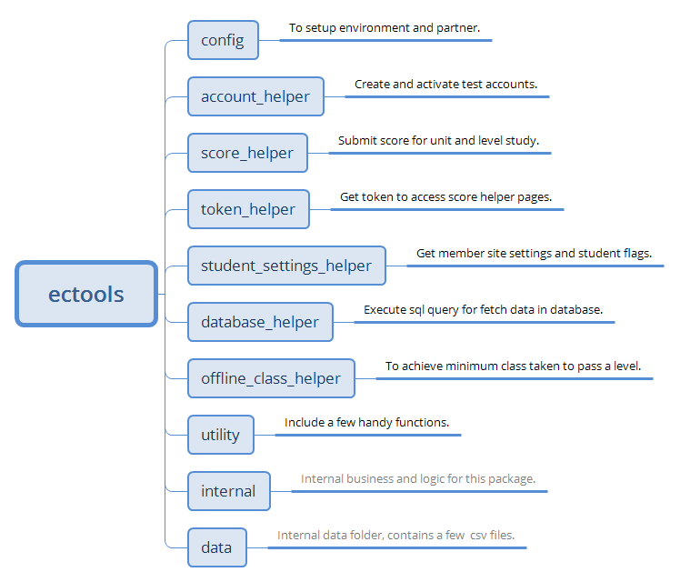

Welcome to ectools's documentation!
===================================
**ectools** is a standalone python package contains helping modules for EFEC testing.

Overview
--------

Installation
------------
You may already have ectools installed -- you can check by doing::

  python -c 'import ectools'

If that fails grab the latest version of and install it with::

  pip install ectools --extra-index-url http://jenkins.englishtown.com:8081/pypi --trusted-host jenkins.englishtown.com

Get Started
-----------
The first step you should do is settiing up ectools, you should specify which environment and partner that you are working on::

  from ectools.config import setup, set_environment, set_partner
  
  # setup for both
  setup(env='UAT', partner='Cool')
  
  # set environment only
  set_environment('QA')
  
  # set_partner only
  set_partner('Mini')
 
By default, it is pointing to **UAT** and **Cool** if you didn't specify anything. Please note, the ``env`` and ``partner`` will be cached in runtime once being set, you can change them by call above method multiple times. BTW, the setting value is case-insenstive, so 'uat', 'UAT' and 'Uat' are all acceptable.

The next step is importing a helper that you want, and call the methods it provided, for example::

  from ectools.account_helper import activate_account
  
  # activate a test account according to environment and partner
  account = activate_account()
  print(account['member_id']) # get its info
  
  # activate a test account with more paramters
  account = activate_account(is_v2=True, startLevel='0B')
  
  for k, v in account.items():
    print("{}=>{}".format(k, v)) # get detail 

If you have your own defined class to present a `Student`, you can convert the above `account` to your object like this::

  from ectools.account_helper import activate_account, convert_account_to_object
  from my.objects import Student, School
  
  account = activate_account()
  student = convert_account_to_object(account, account_object_type=Student, school_object_type=School)
  
  # now it is good to use your object attributes
  print(student.member_id)

To explore more in **ectools**, please check each module from content table by yourself.
  
Module Content
--------------
.. toctree::
  :maxdepth: 2

  ectools

Looking for Help?
-----------------
If you have any issue or feedback on it, please contact EFEC QA team by email.